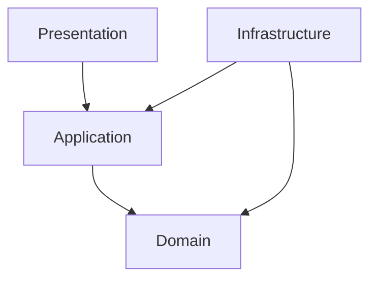

# Clean Architecture

## Dependency rule

Inner layers must not import outer layers.

## Layer rules

| Layer | Allowed dependencies | Forbidden dependencies |
|---|---|---|
| Domain | TypeScript standard library | Hono, DB clients, network calls, environment variables |
| Application | Domain contracts and utilities | HTTP context, request/response objects |
| Infrastructure | Domain interfaces, external clients | Presentation routes |
| Presentation | Application services, schemas, middleware | SQL queries, direct infrastructure state except app wiring |

## Pull request checklist

- New route has schema validation.
- New use case lives in Application, not Presentation.
- New persistence logic implements a Domain repository contract.
- Error shape is consistent with existing handlers.
- Docs and route inventory are updated.
